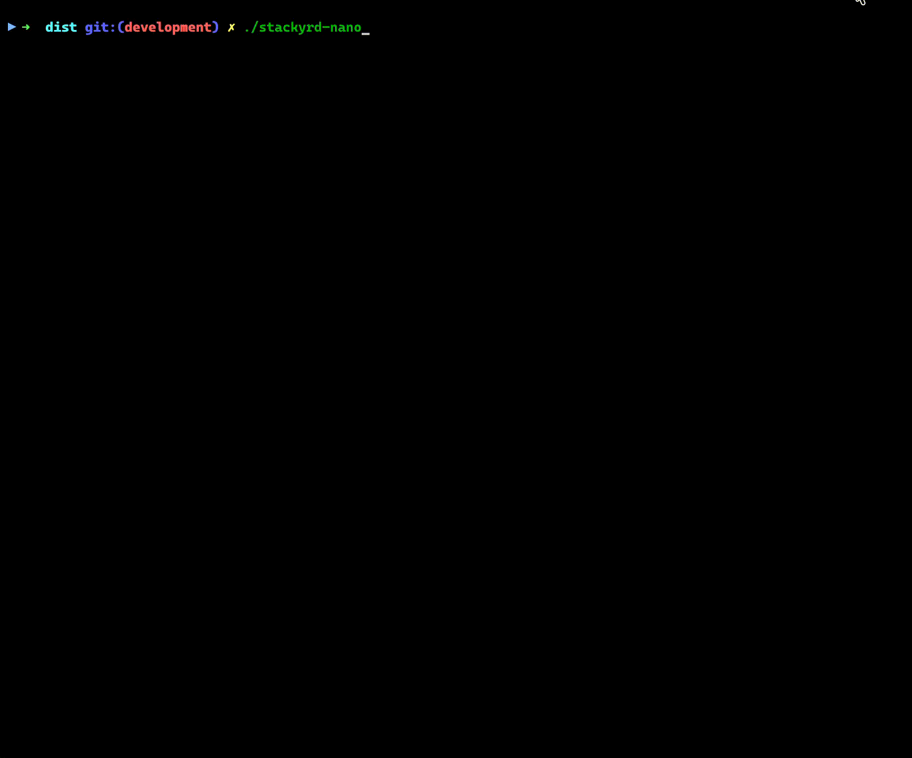

<div align="center">
  
</div>
<div align="center">
  
  
  
  
  
</div>

<br>

## Overview

`stackyrd-nano` is a lightweight, focused evolution of stackyrd. It provides an enterprise-grade service fabric foundation for building robust and observable distributed systems in Go. Our goal is to bridge the gap between rapid development cycles and industrial-strength stability, making complex microservices architectures manageable from day one.

## Key Features

* **Modular Services**: Implement a flexible system where services can be individually enabled or disabled via configuration, simplifying deployment and maintenance.
* **Security by Design**: Built-in mechanisms for API encryption, comprehensive authentication (e.g., JWT), and granular access controls ensure data protection at every layer.
* **Structured Logging**: Provides rich, color-coded console logging output, significantly improving observability during runtime diagnostics.
* **Robust Build Tools**: Automated build scripts handle dependencies, backups, and version archiving, ensuring predictable deployment pipelines.

## Getting Started

### Prerequisites
Before running `stackyrd-nano` ensure you have:
*   Go 1.21+ installed on your system.

### Installation & Run

**Clone the Repository**:
```bash
git clone https://github.com/diameter-tscd/stackyrd-nano.git
cd stackyrd-nano
```
**Install Dependencies**:
The project uses Go Modules, so run:
```bash
go mod download
```
**Run the Application (Development)**:
To test and run the service locally using the main entry point:
```bash
go run cmd/app/main.go
```
**Build for Production**:
To compile a standalone binary suitable for deployment:
```bash
go run scripts/build/build.go
```

## Preview



## Documentation & Resources

*   **Full Documentation**: Access comprehensive guides, API references, and architectural deep-dives here: [https://github.com/diameter-tscd/stackyrd/blob/master/docs_wiki](https://github.com/diameter-tscd/stackyrd/blob/master/docs_wiki)
*   **License**: Distributed under the Apache License Version 2.0. See `LICENSE` for full information.